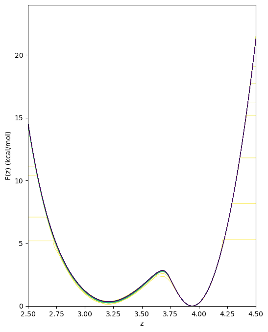
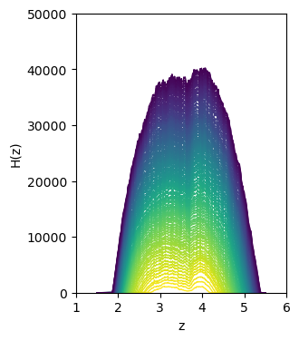
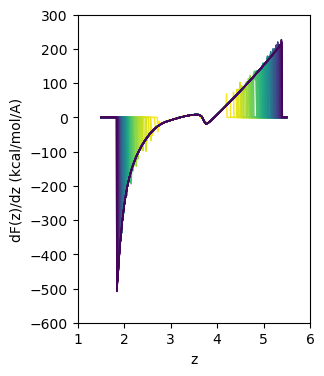

# The Adaptive Biasing Force Method using NAMD

Cameron F. Abrams cfa22@drexel.edu

This directory illustrates ABF simulation of a single butane molecule in vacuum for which the C1-C4 distance is the collective variable.  ABF uses the `colvars` implementation in NAMD.

## Files provided 

1. `butane.psf`, `butane.pdb`, `par_all35_ethers.prm`: necessary input files for a single butane molecule described using the CHARMM force field.
2. `abf.namd`: a NAMD configuration file for running ABF using `colvars`
3. `welltempered.namd`: a NAMD configuration file for running well-tempered metadynamics using `colvars`
4. `hist.py`: a Python script for making plots of the output histories
   ```bash
   $ python hist.py -h
   ```
   to see options.

## Example

In `abf.namd`, ABF is enabled with default parameters, with history output every 100,000 steps.  The three files of history output can be plotted using `hist.py`:
```bash
$ namd2 +p1 abf.namd >& log 
$ python ~/dxu/chet580/instructional-codes/abf/hist.py -f butane_abf_273K.hist.count -figsize 3 4 -xlim 1 6 -ylim 0 50000 -o hist.png -xlabel "z" -ylabel "H(z)" -cmap-name viridis_r -lw 1
 $ python ~/dxu/chet580/instructional-codes/abf/hist.py -f butane_abf_273K.hist.grad -figsize 3 4 -xlim 1 6 -ylim -600 300 -o grad.png -xlabel "z" -ylabel "dF(z)/dz (kcal/mol/A)" -cmap-name viridis_r -lw 1
 $ python ~/dxu/chet580/instructional-codes/abf/hist.py -f butane_abf_273K.hist.pmf -figsize 6 8 -xlim 2.5 4.5 -ylim 0 24 -o pmf.png -xlabel "z" -ylabel "F(z) (kcal/mol)" -cmap-name viridis_r
```



 
