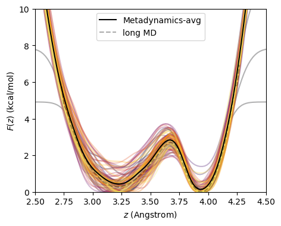
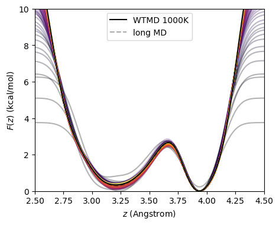

# Metadynamics using NAMD

Cameron F. Abrams cfa22@drexel.edu

This directory illustrates standard and well-tempered metadynamics simulations of a single butane molecule in vacuum for which the C1-C4 distance is the collective variable.  Both approaches use the `colvars` implementation in NAMD.

## Files provided 

1. `butane.psf`, `butane.pdb`, `par_all35_ethers.prm`: necessary input files for a single butane molecule described using the CHARMM force field.
2. `metadynamics.namd`: a NAMD configuration file for running standard metadynamics using `colvars`
3. `welltempered.namd`: a NAMD configuration file for running well-tempered metadynamics using `colvars`
4. `pmfplot.py`: a Python script for making plots of the bias potentials
   ```bash
   $ python pmfplot.py -h
   ```
   to see options.

## Standard Metadynamics

Here, we'll instruct NAMD to output the bias potential at regular intervals.  In standard metadynamics, the best estimator of the free energy is the (negative) time-average of the bias, which is computed by `pmfplot.py` when the `-series-average` argument is supplied.
```bash
$ namd2 +p1 metadynamics.namd >& log 
$ python pmfplot.py -i 'butane_metadynamics.{:d}.pmf' -series 100000 10000000 100000 -o metad.png -series-average
```



## Well-Tempered Metadynamics

Here, we output the bias potential as a function of time only for plot-making purposes; in WTMD, the best estimator of the free energy is just the most recent (negative) bias potential.

```bash
$ namd2 +p1 welltempered.namd >& log
$ python pmfplot.py -i 'butane_welltemperedmetadynamics.{:d}.pmf' -series 100000 10000000 100000 -o wtmd.png
```



## Long MD simulation for reference PMF

The reference potential of mean force is computed by histogramming a long MD simulation; this is left as an exercise.  It can be accomplished easily by using a copy of either NAMD config file here in which the `metadynamics` bias in the `colvars` script is removed.  The `*.traj` file that results can then be processed into a PMF by direct Boltzmann inversion using `pmfplot.py` by providing it to the `-traj-long-md` option.  