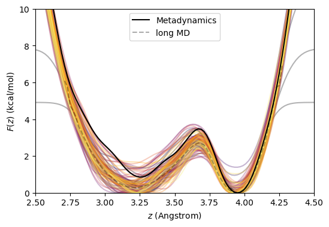

# Metadynamics using NAMD

Cameron F. Abrams cfa22@drexel.edu

## Files provided 

1. `butane.psf`, `butane.pdb`, `par_all35_ethers.prm`: necessary input files for a single butane molecule described using the CHARMM force field.
2. `metadynamics.namd`: a NAMD configuration file for running standard metadynamics
3. `welltempered.namd`: a NAMD configuration file for running well-tempered metadynamics
4. `pmfplot.py`: a Python script for making plots

## Standard Metadynamics

```bash
$ namd2 +p1 metadynamics.namd >& log 
$ python pmfplot.py -i 'butane_metadynamics.{:d}.pmf' -series 100000 10000000 100000 -o metad.png
```



## Well-Tempered Metadynamics

```bash
$ namd2 +p1 welltempered.namd >& log
$ python pmfplot.py -i 'butane_welltemperedmetadynamics.{:d}.pmf' -series 100000 10000000 100000 -o wtmd.png
```

