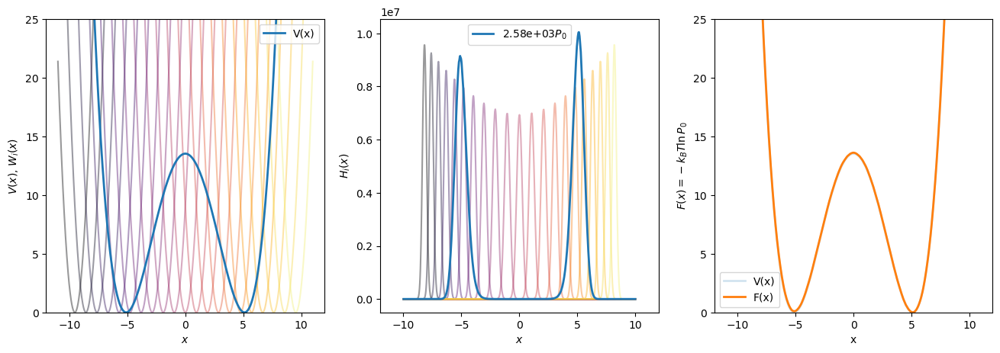

# Weighted Histogram Analysis Method with Brownian Dynamics on a Two-Well Potential

Cameron F Abrams -- cfa22@drexel.edu

`bd-w.c` simulates Brownian dynamics of a single degree of freedom on a quartic two-well potential combined with a harmonic window potential.  Compile:

```bash
$ gcc -o bd-w ../bd-w.c -lm -lgsl -lgslcblas -O5
```
Brownian dynamics (BD) explicitly integrates a diffusive equation of motion with a finite time step optionally specified by the `-dt #.###` argument, for the number of time steps given in the `-ns #####` argument. BD uses a fluctuation-dissipation thermostat to guarantee the degree of freedom samples a Boltzmann distribution at the temperature specified by the `-T #.##` command-line argument.  The optional argument `-gamma #.##` allows you to specify the thermostat friction parameter; by default, it's 5.  

The window potential is harmonic about the window center. The `-x-win #.##` argument allows you to specify the window center and `-k` the spring constant.  The histogram domain is specified using `-x-min #.##` and `-x-max #.##`, and the number of bins by `-hist-n`.  `bd-w` will only sample *one* window, so it is intended to be used multiple times to sample multiple windows.  To keep output files straight, provide a unique number to `-which-win #`.  Each simulation in a set must use the same histogram domain and number of bins!

`bd-w` uses `gsl_histogram` to compute the histograms of the single variable.  It will produce an output data file `p#.dat`, where `#` is replaced with whatever value is given to the `-which-win` argument.  This file is generated by `gsl_histogram_fprintf()` and therefore has *three* columns:

```
<left-edge-of-bin-i> <right-edge-of-bin-i> <value-of-bin-i>
```

Although bin values can be floating-point, `bd-w` does not do any normalization of the histograms.

For example, to run BD at T=1.0 for 10,000,000 time steps with the degree-of-freedom in window 7 centered at 6.5 with a spring constant of 15.0, with statistics kept on a histogram between -8 and 8 in 1,000 bins, you'd issue:

```bash
$ ./bd-w -T 1.0 -ns 10000000 -x-win 6.5 -which-win 7 -k 15.0 -x-min -8 -x-max 8 -hist-n 1000
```
This creates `p7.dat`, which contains the histogram.

The Python script `do_set.py` will run all windows in parallel (as processors allow).
```
$ python ../do-set.py --help
usage: do_set.py [-h] [-np <int>] [-n <int>] [-T <float>] [-k <float>]
                 [-zlim zmin<float> zmax<float>]

optional arguments:
  -h, --help            show this help message and exit
  -np <int>             number of processors to use in parallel
  -n <int>              number of windows
  -T <float>            Temperature
  -k <float>            Window potential spring constant
  -zlim zmin<float> zmax<float>
                        limits on histogram domain
```
You will now have files like `p0.dat`, `p1.dat`, ...  These are the biased histograms.  The Python script `multiplot.py` will perform WHAM and generate a three-panel plot.  The Landau free energy is stored in a file named by the `-of` argument.  The help for `multiplot.py`:

```
usage: multiplot.py [-h] [-n <int>] [-zlim zmin zmax] [-k <float>]
                    [-T <float>] [-tol <float>] [-fylim y-low y-high]
                    [-p <str>] [-fpot <str>] [-w <str>] [-o <str>] [-of <str>]

optional arguments:
  -h, --help           show this help message and exit
  -n <int>             number of windows
  -zlim zmin zmax      limits on histogram domain
  -k <float>           window potential spring constant
  -T <float>           temperature
  -tol <float>         WHAM tolerance
  -fylim y-low y-high  ylims for potential plot
  -p <str>             filename format for window histograms
  -fpot <str>          file containing governing potential vs z
  -w <str>             files containing window potentials
  -o <str>             output plot image file
  -of <str>            output data file containing F vs z
```

A single example workflow:
```
$ python ../do_set.py -np 16 -n 16 -T 0.5 -k 15.0 -zlim -8 8
$ python ../multiplot.py -n 16 -of tp1.dat  -o tp1.png -T 0.5 -k 15.0 -zlim -8 8
```

The output image:


