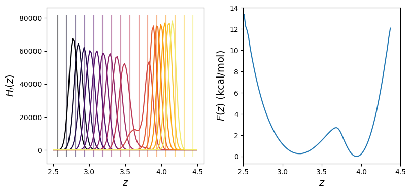

# Weighted Histogram Analysis Method

An exercise with butane using NAMD

Cameron F Abrams cfa22@drexel.edu

## Files provided here

1. `butane.psf`, `butane.pdb`, `par_all35_ethers.prm`: necessary input files for a single butane molecule described using the CHARMM force field.
2. `base.namd`: a template NAMD config file
3. `do_set.py`: a Python script for running all window simulations
4. `cfa_wham.py`: a Python script for processing widowed samples into a single unbiased free energy

## Instructions

1. Run set of window simulations (check `do_set.py` for command-line options to use)
   ```bash
   $ python do_set.py -n 16
   ```
   This will generate `window#.colvars.traj` that contains direct samples of `z` for each window, where the `#` is replace with the window index.  It also generates `info.in`, a summary table of the window simulations that `cfa_wham.py` will use to construct `F(z)`.
2. Do WHAM:
   ```bash
   $ python cfa_wham.py -nbins 100 -traj-filename-format 'window{:d}.colvars.traj' -zlim 2.5 4.5
   ```
   By default, this generates `plot.png`.

   Here is that plot:
   
   